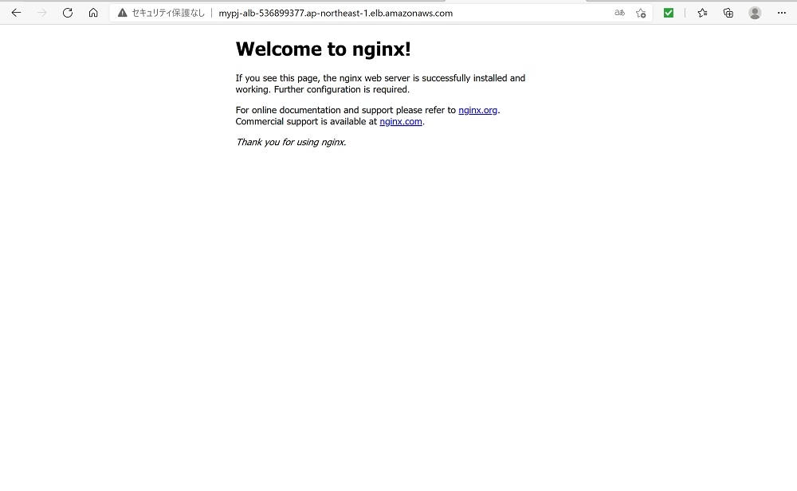

# aws_cloudformation_works
## はじめに
AWS CloudFormationを使用して、AWS上に環境構築するCloudFormationテンプレート・ファイルです。
下記環境を構築します。
- Amazon ECS上のNginxコンテナをZabbixを用いて監視
- 各Nginxコンテナのログは、サイドカーコンテナのFireLensを経由しFluentdサーバへ集約
- サーバ間の内部アクセス時の名前解決は、Amazon Route53のプライベートホストゾーンを利用
- ECSクラスタを構成するEC2インスタンスについて、プライベートホストゾーンへのDNSレコード登録は、Amazon Lambdaによりインスタンス起動/終了時に自動登録/削除
- CloudFormationでの環境構築時の作業領域としてAmazon S3を利用
### AWS構成図


### Zabbix監視
下記項目を監視します。  

| 監視項目 | 監視対象 |
|--|--|
| リソース監視 | ECS上の各コンテナ、ECSクラスタを構成する各EC2 |
| ログ監視  | Nginxコンテナのアクセスログ、エラーログ |

<br>

## ディレクトリ構成
```
├─cfn
│  │  make_upload_cfn_template_file.ps1
│  │  work-main.yml
│  │
│  └─template
│          work-ecs-cluster.yml
│          work-ecs-service.yml
│          work-fluentd-server.yml
│          work-iamrole.yml
│          work-lambda.yml
│          work-lb.yml
│          work-route53.yml
│          work-securitygroup.yml
│          work-vpc.yml
│          work-zabbix-server.yml
│
└─s3
    │  edit_record.py
    │  edit_record.zip
    │  td-agent.conf
    │
    └─ansible_playbook
```
**cfn**<br>
CloudFormationテンプレート・ファイル（以下CFnテンプレート）のフォルダです。
- work-main.yml<br>
親となるCFnテンプレート・ファイルです。
子となるtemplateフォルダ配下の各テンプレートをこのファイルで参照して統合しています。
- template<br>
AWSの各コンポーネントごとにCFnテンプレートを分けています。
- make_upload_cfn_template_file.ps1<br>
親CFnテンプレート・ファイルでデプロイする際、予め子CFnテンプレート・ファイルがS3にアップロードされている必要があります。このPowerShellスクリプトは、AWS CLIのコマンドを使い、S3アップロード及び、編集した親CFnテンプレート・ファイル（親CFnテンプレート・ファイルの子テンプレート参照パスをS3パスへ修正）を新規作成します。<br>
なお、本PowerShellスクリプトは、AWS CLIのコマンドを使用しているため、実行環境にAWS CLIがインストールされている必要があります。

**s3**<br>
本CFnテンプレートでデプロイする際に、予め作業用領域のS3バケットにアップロードしておく必要があるファイル群です。(edit_record.pyは不要)
- edit_record.zip<br>
Lambda Zipファイルです。edit_record.pyを圧縮した物です。ECSクラスタのEC2インスタンス起動/終了時に、プライベートIPアドレスのAレコードをRoute53 プライベートホストゾーンに登録/削除するPythonスクリプトです。
- td-agent.conf<br>
Fluentdサーバのfluentdデーモンの設定ファイルです。
- ansible_playbook<br>
Zabbixサーバを構築するAnsibleのPlaybookです。
内容は[ansible_zabbix_setupリポジトリ](https://github.com/sfarm21/ansible_zabbix_setup.git)と同一です。hostsとグループ変数のファイルはAWS用に編集しています。

<br>

## 利用方法

### 準備
１．初めに作業領域用のS3バケット作成します。そして、そのS3バケットに本リポジトリのs3フォルダに格納されているファイル群をアップロードします。<br>
２．次に、CloudFormationでデプロイ用のCFnテンプレート・ファイルを作成します。まず、「make_upload_cfn_template_file.ps1」ファイルをエディタで開き、「$s3_bucket=」以降に記載されている作業領域用のS3バケット名を自身のバケット名に修正します。<br>
この状態でPowerShellコンソール上で本スクリプトを実行すると、同フォルダに「work-main-template.yml」としてデプロイ用のCFnテンプレート・ファイルが作成されます。

```
> ls
Mode                 LastWriteTime         Length Name
----                 -------------         ------ ----
d-----    2021/04/25(日)     20:54                template
-a----    2021/04/22(木)     22:25            216 make_upload_cfn_template_file.ps1
-a----    2021/04/24(土)     20:45           5496 work-main.yml

> .\make_upload_cfn_template_file.ps1

```

### CloudFormationによるデプロイ
１．AWSマネジメントコンソールのCloudFormationサービス画面にて、「work-main-template.yml」をアップロードしてスタックを作成します。<br>
２．パラメータ入力画面では、基本的にデフォルト値で問題ありませんが、
作業領域用S3バケット名は修正する必要があります。

<br>
３．スタック作成が正常に完了すると、「`http://ZabbixサーバのパブリックIP/zabbix`」よりZabbix Webポータルの初回設定画面にアクセスできるようになります。
初回設定を進めていき、ログイン画面が表示されるまで進めます。<br>
４．Zabbixサーバにターミナルからec2-userでSSH接続し、「~/ansible_playbook」ディレクトリ内に存在する「Zabbixホスト登録、テンプレートインポート用Playbook」を実行します。
```
# Zabbixホスト登録、テンプレートインポート用Playbookを実行
ansible-playbook -i hosts add_zabbix_host.yml
```
Playbookが正常に終了したのを確認後、Zabbix Webポータルからログインします。左ペインから設定→ホストと確認すると、監視対象ホストが登録されていることが確認できます。

<br>

## 構築環境確認
### Nginxサーバアクセス
AWSマネジメントコンソールのEC2サービス画面より、作成したロードバランサーからDNS名をコピーします。
WebブラウザでDNS名にアクセスすると、ロードバランサーを介してNginx画面が表示されることが確認できます。


### Zabbixモニタリング
**リソース監視**<br>
監視データ→ホスト→グラフより<br>
サーバ、コンテナのCPU・メモリ等のリソース値をグラフでモニタリングできます。


**ログ監視**<br>
監視データ→最新データ→Fluentd収集ログ→ヒストリより<br>
各NginxコンテナからFluentdサーバへ集約されたログをモニタリングできます。ロードバランサーからのヘルスチェックによるアクセスや、自身がブラウザからアクセスしたログを確認できます。


